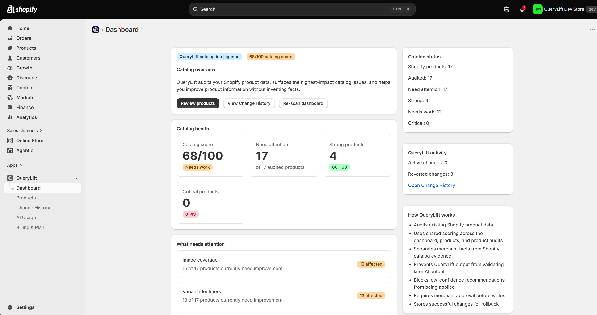
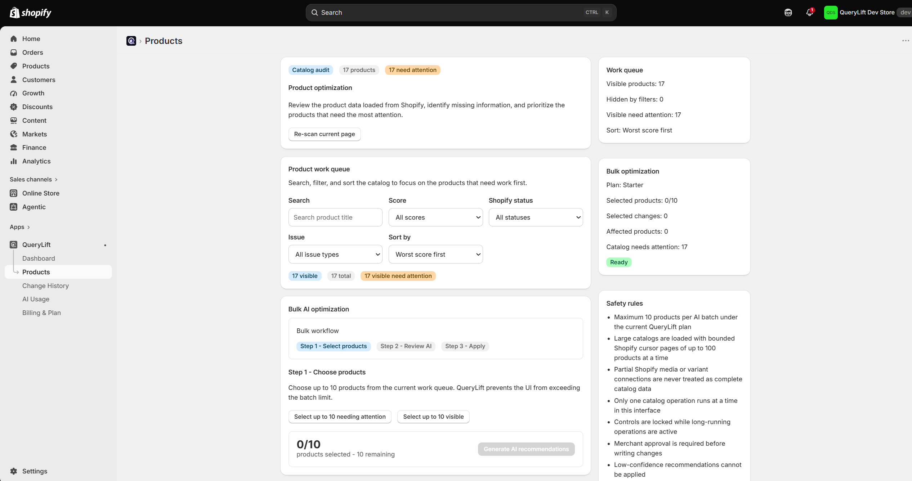
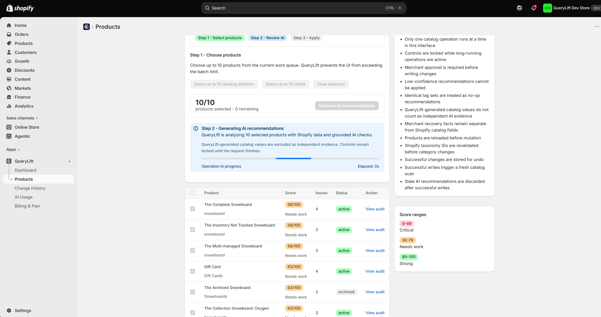
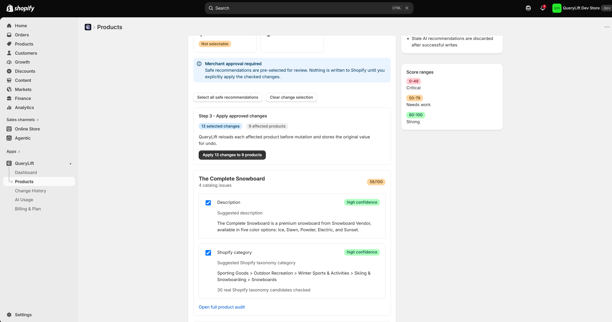
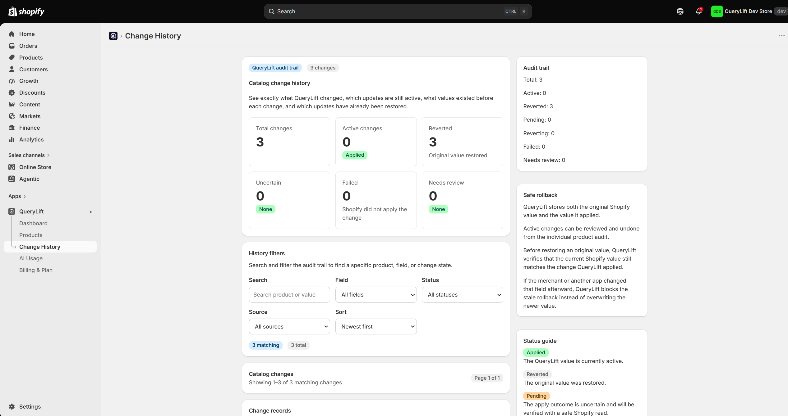

# QueryLift

QueryLift is a Shopify application built to audit merchant product catalogs, identify product-data issues, generate grounded AI recommendations, and safely apply approved improvements back to Shopify.

The project is built with TypeScript, React Router, Shopify Polaris, and Shopify's GraphQL Admin API, with a strong focus on reliability, safe mutations, testing, and merchant control.

> The production application repository is maintained privately.

## App Preview

<table>
  <tr>
    <td align="center"><strong>Dashboard</strong></td>
    <td align="center"><strong>Product Audit</strong></td>
  </tr>
  <tr>
    <td></td>
    <td></td>
  </tr>
</table>

<table>
  <tr>
    <td align="center"><strong>AI Recommendations</strong></td>
    <td align="center"><strong>Review & Apply</strong></td>
  </tr>
  <tr>
    <td></td>
    <td></td>
  </tr>
</table>

  <strong>Change History & Rollback</strong>

  

## What QueryLift Does

QueryLift helps Shopify merchants understand and improve the quality of their product catalog.

The application can:

- Audit Shopify product data
- Score catalog health
- Surface products that need attention
- Identify missing or weak product information
- Generate AI-assisted recommendations
- Keep recommendations grounded in Shopify catalog facts
- Require merchant approval before writes
- Apply selected changes back to Shopify
- Track every successful catalog change
- Restore previous values through rollback workflows
- Monitor AI usage and plan limits
- Handle Shopify billing and subscription plans

## Tech Stack

- TypeScript
- React Router
- Shopify Polaris
- Shopify Admin GraphQL API
- Node.js
- Prisma
- Shopify Billing
- Webhooks
- Automated testing
- Git / GitHub

## Engineering Highlights

- Built merchant-facing application workflows using TypeScript, React Router, and Shopify Polaris.
- Integrated Shopify's Admin GraphQL API for catalog retrieval and product mutations.
- Centralized GraphQL requests behind a shared reliability layer.
- Added explicit handling for GraphQL-level errors and malformed responses.
- Built catalog health scoring and issue classification across Shopify product data.
- Implemented bounded catalog processing to avoid unsafe assumptions on larger stores.
- Added partial-catalog states when the complete catalog cannot safely be represented.
- Implemented AI-assisted product optimization workflows with merchant-controlled approval.
- Added safeguards preventing low-confidence recommendations from being applied automatically.
- Built change-history tracking and rollback support for catalog mutations.
- Integrated Shopify billing and plan enforcement.
- Added AI usage limits and token-reservation logic.
- Hardened application behavior around duplicate writes, stale recommendations, and mutation safety.

## Catalog Audit

QueryLift analyzes Shopify product data and produces a catalog score based on issues discovered across the store.

The dashboard surfaces:

- Overall catalog score
- Products needing attention
- Strong products
- Critical products
- High-impact issue categories
- Catalog audit status

The goal is to help merchants prioritize the products that need work first.

## AI Optimization Workflow

QueryLift includes a controlled AI-assisted optimization workflow.

The process follows three steps:

1. **Select products**
2. **Generate and review AI recommendations**
3. **Approve and apply changes**

The application limits the number of products processed per batch and locks conflicting controls while long-running operations are active.

Important safeguards include:

- Merchant approval required before writes
- Low-confidence recommendations blocked
- Products reloaded before mutation
- Shopify taxonomy IDs revalidated
- Stale AI recommendations discarded after successful writes
- QueryLift-generated values excluded as independent AI evidence

## Shopify GraphQL Integration

Shopify product and store data is accessed through the Admin GraphQL API.

Development work included:

- Product catalog queries
- Pagination and bounded catalog reads
- Product mutations
- GraphQL error handling
- Response validation
- Catalog-size safeguards
- Shared API reliability infrastructure

GraphQL access was consolidated so application code does not make inconsistent direct API calls throughout the codebase.

## Change History & Rollback

Every successful catalog change records both:

- The value applied by QueryLift
- The original Shopify value

This allows merchants to review and restore previous product data.

Rollback behavior includes safety checks to ensure QueryLift does not overwrite newer merchant changes with stale historical data.

The application tracks change states such as:

- Applied
- Reverted
- Pending
- Failed
- Needs review

## Reliability & Testing

Reliability has been a major focus of the project.

The application currently passes:

- **129 automated tests**
- TypeScript type checking
- Production build validation
- Real Shopify development-store smoke testing

Testing covers application behavior, Shopify GraphQL reliability, billing workflows, webhook-related behavior, and regression protection around important product workflows.

## Engineering Approach

Development has followed an incremental production-oriented process:

1. Inspect existing behavior
2. Add regression coverage
3. Make small architectural improvements
4. Centralize external API interactions
5. Handle failure and edge cases explicitly
6. Run automated tests
7. Run TypeScript validation
8. Create production builds
9. Smoke test against a real Shopify development store

## Source Code

The primary QueryLift application repository remains private because it contains active application and integration code.

This public repository provides a technical and visual overview of the project.

## Developer

**Risto Caissie**  
Software Developer — Calgary, Alberta

📧 ristocaissie1@gmail.com
